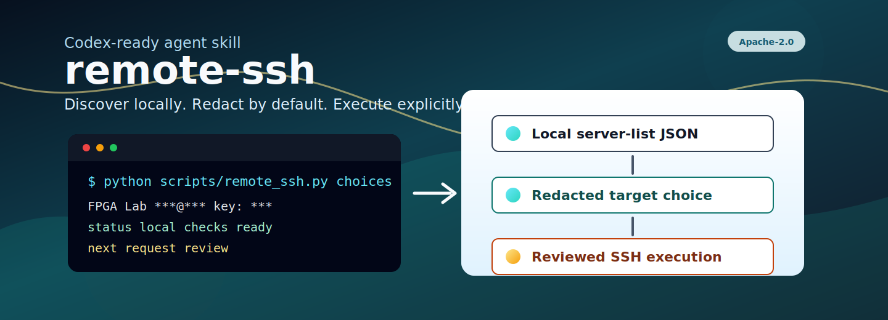
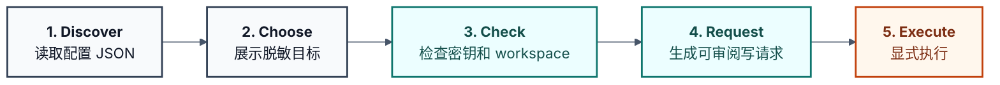

<p align="center">
  <a href="README.md">English</a>
  <span>&nbsp;|&nbsp;</span>
  <a href="README-CN.md"><strong>中文</strong></a>
</p>

<p align="center">
  
</p>

<p align="center">
  <a href="LICENSE"></a>
  <a href="pyproject.toml"></a>
  
  <a href="SKILL.md"></a>
  <a href="references/review-checklist.md"></a>
</p>

<h1 align="center">remote-ssh</h1>

<p align="center">
  面向 Codex 的保守型远程 SSH 开发与测试工作流 agent skill。
</p>

`remote-ssh` 让 AI 编程代理在处理远程 SSH 任务时更有边界感：先本地发现配置、展示可选服务器、检查密钥和工作目录，再通过可审阅的 request 文件执行写入或任意命令。默认输出会隐藏连接细节，避免把真实账号、主机、端口和密钥路径带进公开记录。

这个仓库主要是一个 **agent skill package**。Python CLI 是确定性执行层，核心入口仍然是 agent 加载并遵循的 `SKILL.md`。

公开仓库名是 `remote-ssh`；内部 Codex skill 名称仍保留为 `erie-remote-ssh`，以兼容现有触发规则和提示词。

## 为什么需要它

远程 SSH 工作很容易把敏感信息和危险操作混在一起：真实主机、用户名、端口、密钥路径、远程工作目录、删除命令、上传命令、库存扫描结果，都不应该随手进入公开仓库或聊天记录。`remote-ssh` 的目标是让 agent 每一步都更明确、更可审阅。

适用场景包括：

- SSH 服务器发现、server-list 校验和目标选择。
- 密钥/免密 SSH 就绪检查，但不修改 `~/.ssh`。
- 远程 `~/workspace` 检查和限定在 `workdir` 内的文件操作。
- 命令、上传、建目录、删除等写操作的 request 审阅流程。
- Python、Conda、CUDA、GCC/G++、CMake、Vivado、Vitis 等软件可用性缓存查询。
- 面向开发、FPGA、GPU 和应用测试环境的只读远程 inventory。

## 工作流



## 快速开始

克隆仓库：

```powershell
git clone https://github.com/Eriemon/remote-ssh.git
cd remote-ssh
```

查看 CLI：

```powershell
python .\scripts\remote_ssh.py --help
python .\scripts\remote_ssh.py discover --help
python .\scripts\remote_ssh.py list --help
```

从非敏感模板创建私有 server list，或把真实配置放在仓库外并用 `--config` 指定：

```powershell
Copy-Item .\config\server_list.template.json .\config\server_list.local.json
python .\scripts\remote_ssh.py discover
python .\scripts\remote_ssh.py choices
```

`config/server_list.template.json` 只是占位模板。真实 hostname、username、port、key name、key path、inventory snapshot 和 scan cache 都属于私有运行数据。

## 隐私默认值

仓库公开文件不保存真实账号或主机信息。默认本地配置路径是 `${skill_dir}/config/server_list.local.json`，该文件不会随仓库发布。

默认输出会隐藏 host、username、port、key name 和 key path。只有在明确需要可运行连接细节时，才使用 `--show-sensitive`。

提交或发布前，确认下面这些内容没有进入 git：

- `config/server_list.local.json`
- `config/*.bak` 和 `config/*.bak.*`
- `requests/`
- `downloads/`
- `tmp/`
- `logs/`
- `*.log`
- 私钥、真实公钥注释、真实 IP、真实域名、真实用户名、本机用户路径、inventory snapshot 或远程主机细节。

本仓库按要求不包含根级 `.gitignore`；提交前请用 `git status --short` 人工确认没有运行产物或敏感配置。

## Skill 使用

Codex skill 触发名仍然是 `$erie-remote-ssh`。

推荐 agent 使用确定性 helper：

```powershell
python .\scripts\remote_ssh.py discover
python .\scripts\remote_ssh.py choices
python .\scripts\remote_ssh.py check --server <id-or-name>
python .\scripts\remote_ssh.py workspace-check --server <id-or-name>
python .\scripts\remote_ssh.py request-command --server <id-or-name> --reason "check current directory" -- pwd
python .\scripts\remote_ssh.py run-request --request <request.json> --execute
```

详细说明见：

- `SKILL.md`
- `references/configuration.md`
- `references/server-list-schema.md`
- `references/workflows.md`
- `references/review-checklist.md`

## 校验

发布前运行离线校验：

```powershell
python .\scripts\validate_remote_ssh.py
```

真实 SSH 测试需要显式传入私有 server list：

```powershell
python .\scripts\validate_remote_ssh.py --with-ssh --server-list <private-server-list.json>
```

## 联系方式

开发者：Jiyuan Liu。问题、合作或学术使用，请联系：[erie@seu.edu.cn](mailto:erie@seu.edu.cn)。

## 引用

如果本 skill 对你的研究、教学或工程流程有帮助，请引用。规范引用元数据以 [CITATION.cff](CITATION.cff) 为准。

```bibtex
@software{liu_2026_remote_ssh,
  author       = {Jiyuan Liu},
  title        = {{remote-ssh}: An Agent Skill for Conservative SSH Workflows},
  year         = {2026},
  version      = {0.1.0},
  date         = {2026-05-08},
  url          = {https://github.com/Eriemon/remote-ssh},
  license      = {Apache-2.0},
  note         = {Agent skill package for conservative SSH-based development and test workflows}
}
```

## 许可证

Apache-2.0，见 `LICENSE`。
