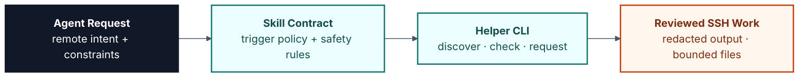
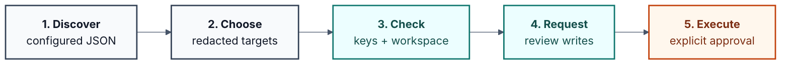

<p align="center">
  <a href="README.md"><strong>English</strong></a>
  <span>&nbsp;|&nbsp;</span>
  <a href="README-CN.md">中文</a>
</p>

<p align="center">
  
</p>

<p align="center">
  <a href="LICENSE"></a>
  <a href="pyproject.toml"></a>
  
  <a href="SKILL.md"></a>
  <a href="references/review-checklist.md"></a>
</p>

<h1 align="center">remote-ssh</h1>

<p align="center">
  A Codex-ready agent skill for conservative SSH-based development and test workflows.
</p>

`remote-ssh` turns an AI coding agent into a more careful remote-development operator. It provides trigger metadata, workflow instructions, deterministic helper scripts, configuration templates, request review flows, and validation gates for SSH work that needs explicit target selection and redacted output by default.

This repository is primarily an **agent skill package**. The Python CLI is included as the deterministic execution layer, but the main interface is the skill surface an agent can load and follow.

The public repository is named `remote-ssh`; the internal Codex skill name intentionally remains `erie-remote-ssh` for compatibility with existing skill triggers and prompts.

## Why It Exists

Remote SSH work has sharp edges: credentials, hostnames, key paths, write boundaries, and commands that can affect another machine. `remote-ssh` makes the agent discover configured targets locally, present choices, validate key and workspace readiness, keep built-in file operations inside `workdir`, and create reviewable request files before writes or arbitrary commands.

Use it when an agent needs to work on:

- SSH target discovery, guided configuration, server-list validation, and target selection.
- Passwordless/key-based SSH readiness checks without modifying `~/.ssh`.
- Guided key-only repair for existing entries through `configure-key --interactive`.
- Remote `~/workspace` validation and bounded file operations.
- Reviewed command, upload, mkdir, and delete requests.
- Cached software availability checks for Python, Conda, CUDA, GCC/G++, CMake, Vivado, and Vitis, including multi-version scan results.
- Read-only remote inventory for development, FPGA, GPU, and application-test environments.

## Skill Architecture



## Workflow



## Quick Start

Clone the repository:

```powershell
git clone https://github.com/Eriemon/remote-ssh.git
cd remote-ssh
```

Inspect the CLI:

```powershell
python .\scripts\remote_ssh.py --help
python .\scripts\remote_ssh.py discover --help
python .\scripts\remote_ssh.py list --help
python .\scripts\remote_ssh.py configure --help
```

Create a private server list from the non-sensitive template, or keep it outside the repository and pass it with `--config`:

```powershell
Copy-Item .\config\server_list.template.json .\config\server_list.local.json
python .\scripts\remote_ssh.py discover
python .\scripts\remote_ssh.py choices
```

`config/server_list.template.json` is only a placeholder. Real hostnames, usernames, ports, key names, key paths, inventory snapshots, and scan caches are operational data and should stay private.

Use `configure --interactive` as the guided configuration gate before creating or changing server entries. It asks for manual, script, or cancel mode explicitly; lower-level `add-server --interactive` and `update-server --interactive` still validate entries, preserve reviewable backups, and run the mandatory read-only software scan for enabled servers.

`workspace-check` writes validation and workspace status back to the selected private server list, then refreshes the cached `software_scan`. Run `scan-software` when tool installs change, and use `software` or `software --name <tool>` to inspect cached availability without reconnecting. Upload requests are restricted by `paths.upload_roots`, which defaults to the project root.

Use `configure-key --interactive` only after an explicit guided choice for an existing server whose key reference or passwordless login needs repair. Bundled request and download artifacts now default under `${skill_dir}/reports`; preserve any existing `reports/` directory before replacing an installed skill unless cleanup is explicitly requested.

## Privacy Defaults

The helper does not store real account or host information in the public files in this repository. The default local configuration path is `${skill_dir}/config/server_list.local.json`, and that file is intentionally absent from the repository.

Default output redacts host, username, port, key name, and key path. Use `--show-sensitive` only when you explicitly need runnable connection details.

Before publishing changes, check that these are not staged or committed:

- `config/server_list.local.json`
- `config/*.bak` and `config/*.bak.*`
- `requests/`
- `downloads/`
- `reports/`
- `tmp/`
- `logs/`
- `*.log`
- Private keys, real public-key comments, real IPs, real domains, real usernames, local user paths, inventory snapshots, or remote host details.

The root `.gitignore` covers these local operational paths, but still review `git status --short` before committing.

## Skill Usage

The Codex skill trigger remains `$erie-remote-ssh`.

Agents should use the deterministic helper whenever possible:

```powershell
python .\scripts\remote_ssh.py discover
python .\scripts\remote_ssh.py choices
python .\scripts\remote_ssh.py configure --interactive
python .\scripts\remote_ssh.py update-server --server <id-or-name> --interactive
python .\scripts\remote_ssh.py configure-key --server <id-or-name> --interactive
python .\scripts\remote_ssh.py check --server <id-or-name>
python .\scripts\remote_ssh.py workspace-check --server <id-or-name>
python .\scripts\remote_ssh.py scan-software --server <id-or-name>
python .\scripts\remote_ssh.py software --server <id-or-name> --name vivado
python .\scripts\remote_ssh.py request-command --server <id-or-name> --reason "check current directory" -- pwd
python .\scripts\remote_ssh.py run-request --request <request.json> --execute
```

For detailed behavior, read:

- `SKILL.md`
- `references/configuration.md`
- `references/server-list-schema.md`
- `references/workflows.md`
- `references/review-checklist.md`

## Validation

Run the offline validation suite before publishing:

```powershell
python .\scripts\validate_remote_ssh.py
```

Real SSH tests are opt-in and require an explicit private server list:

```powershell
python .\scripts\validate_remote_ssh.py --with-ssh --server-list <private-server-list.json>
```

## Affiliation

Jiyuan Liu and He Li are with the School of Electronic Science and Engineering, Southeast University.
They are affiliated with the Heterogeneous Intelligence and Quantum Computing Laboratory (HIQC), which works on heterogeneous intelligence, quantum computing, and related computing systems research.

## Contact

Developer: Jiyuan Liu. For questions, collaboration, or academic use, contact: [erie@seu.edu.cn](mailto:erie@seu.edu.cn).

## Citation

This skill is maintained by authors from the Heterogeneous Intelligence and Quantum Computing Laboratory(HIQC), School of Electronic Science and Engineering, Southeast University.

If this skill helps your research, teaching, or engineering workflow, please cite it. The canonical citation metadata is maintained in [CITATION.cff](CITATION.cff).

```bibtex
@software{liu_2026_remote_ssh,
  author       = {Jiyuan Liu and He Li},
  title        = {{remote-ssh}: An Agent Skill for Conservative SSH Workflows},
  year         = {2026},
  version      = {0.1.8},
  date         = {2026-05-11},
  url          = {https://github.com/Eriemon/remote-ssh},
  license      = {Apache-2.0},
  note         = {Agent skill package for conservative SSH-based development and test workflows}
}
```

## License

Apache-2.0. See `LICENSE`.
